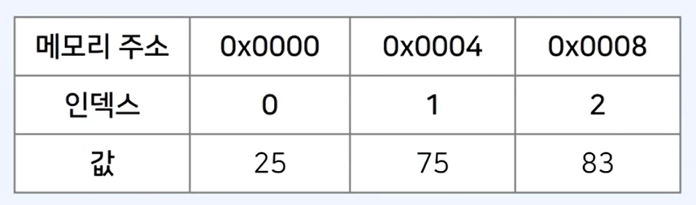
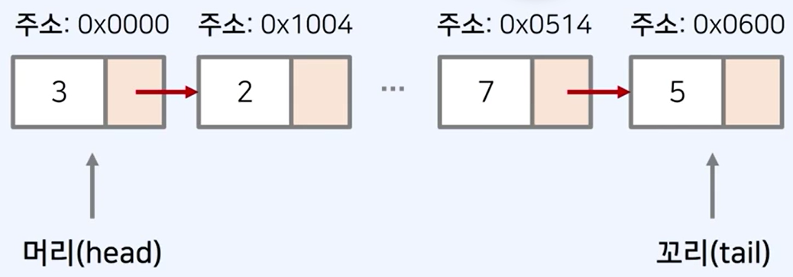

# 배열
- 가장 기본적인 자료구조
- 여러 개의 변수를 담는 공간
- index가 존재, 0부터 시작
- 특정 index에 직접 접근 가능 => 수행시간: O(1)

# 특징
- <p style="background-color: #fff5b1; display: inline-block">컴퓨터의 메인 메모리에서 배열의 공간은 연속적으로 할당된다.</p>

## 장점
- 캐시(cache) 히트 가능성이 높으며, 조회가 빠르다.
- 캐시가 참조하고자 하는 메모리에 캐시가 존재하고 있는 경우를 캐시 히트(Cache Hit)라고 한다.
- 거꾸로 참조하고자 하는 메모리에 캐시가 없는 경우를 캐시 미스(Cache Miss)라고 한다. 
## 단점
- 배열의 크기를 미리 지정하는것이 일반적으로, 데이터의 추가 및 삭제에 한계가 존재.


# 연결 리스트

- 연결 리스트는 컴퓨터의 메인 메모리 상에서 주소가 연속적이지 않다.
- 배열과 다르게 크기가 정해져 있지 않고, 리스트의 크기는 동적으로 변경이 가능하다.

## 장점
포인터(Pointer)를 통해 다음 데이터의 위치를 가리킨다는 점에서 삽입과 삭제가 간편

## 단점
특정 번째의 원소를 검색할 때는 앞에서부터 찾아야하기 때문에 데이터 검색 속도가 느리다.




### 참고

1. 연결리스트를 직접 구현하지 않아도 대부분의 알고리즘 문제를 해결하는데는 문제가 없다.
2. 자바스크립트에서는 기본적인 배열 기능을 제공한다.
3. 자바스크립트의 배열 자료형은 동적 배열이다. 
4. 배열 내부의 용량이 가득차면 자동으로 크기를 증가시킨다. 
5. 내부적으로 포인터(Pointer)를 사용하며, 연결 리스트의 장점을 가지고 있다.
6. 배열(Array) 혹은 스택(Stack)의 기능이 필요할 때 사용할 수 있다.
7. 다만 큐(Queue)의 기능을 제공하지 못한다. => **자바스크립트에서는 큐를 직접 구현하여야 한다.**
=> Node.js에서 비동기처리를 맡고있는 libuv 라이브러리에서 큐를 구현하고 있음. 이벤트루프 동작 방식처럼 스택에 입력된 실행컨텍스트들이 종료되어야 큐에서 하나씩 스택으로 넘어가 실행됨.


## Javascript 배열 생성 방법

**1차원 배열**
```javascript
// 직접 초기화
let arr1 = [0, 1, 2, 3, 4, 5];
console.log(arr1);

// 하나의 값으로 초기화
let arr2 = Array.from({length: 5}, () => 7);
console.log(arr2); // [7,7,7,7,7]

```
**2차원 배열**
```javascript
// 직접 초기화
let arr1 = [
    [0,1,2,3],
    [4,5,6,7],
    [8,9,10,11]
]
console.log(arr1);

// 한줄로 2차원 배열 초기화
let arr = Array.from(Array(4), () => new Array(5));
console.log(arr);
// [
//  [ <5 empty items>],
//  [ <5 empty items>],
//  [ <5 empty items>],
//  [ <5 empty items>]
// ]

// 반복문을 이용한 초기화
let arr2 = new Array(3);
for (let i = 0; i < arr2.length; i++) {
    arr2[i] = Array.from({length: 4}, (undefined, j) => i * 4 + j);
}
console.log(arr2);
// [
//  [0,1,2,3],
//  [4,5,6,7],
//  [8,9,10,11],
// ]
```

**동적 배열**
```javascript
// 동적배열은 배열이 생성된 이후에도 배열의 크기를 임의로 조절 가능
// push 메서드를 통해 배열의 가장 뒤쪽에 새로운 원소 추가 가능

let arr = [5,6,7,8,9];
arr.length = 8;
arr[7] = 3;
arr.push(1);

for (let x of arr) {
    console.log(x)
}
// 5
// 6
// 7
// 8
// 9
// undefined
// undefined
// 3
// 1
```


**concat()**
```javascript
let arr1 = [1, 2, 3, 4, 5,];
let arr2 = [6, 7, 8, 9, 10];
let arr = arr1.concat(arr2, [11, 12], [13]);
console.log(arr) // [1,2,3,4,5,6,7,8,9,10,11,12,13];
```

**slice()**
```javascript
// 특정 구간의 원소를 꺼낸 배열을 반환
let arr = [1,2,3,4,5];
let result = arr.slice(2,4);
console.log(result); // [3,4]
```

indexOf()
```javascript
// 배열에서 해당 하는 원소의 index를 리턴
// 해당하는 원소가 없으면 -1 리턴
let arr = [7,3,5,6,6,2,1];

console.log(arr.indexOf(5)); // 2
console.log(arr.indexOf(6)); // 3
console.log(arr.indexOf(8)); // -1
```
