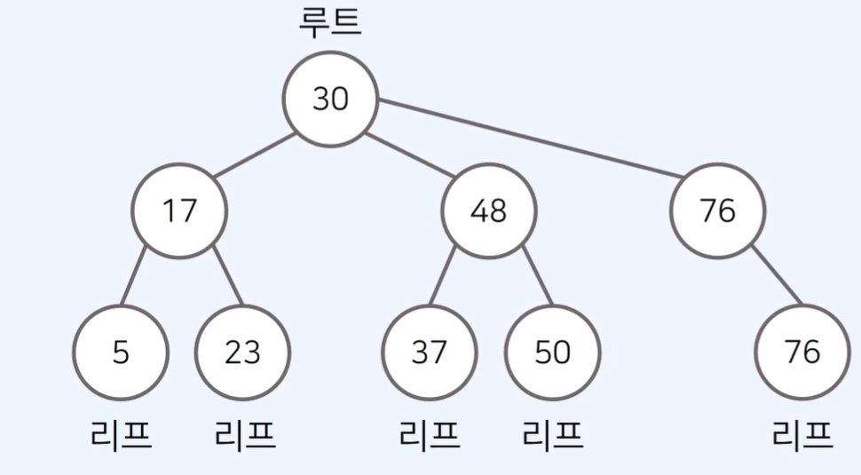
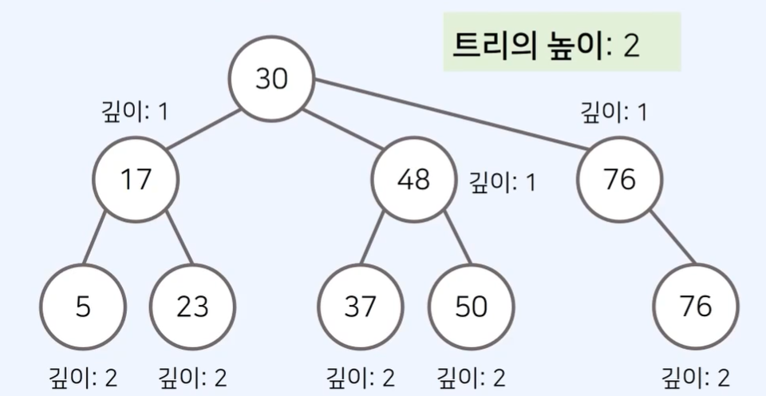
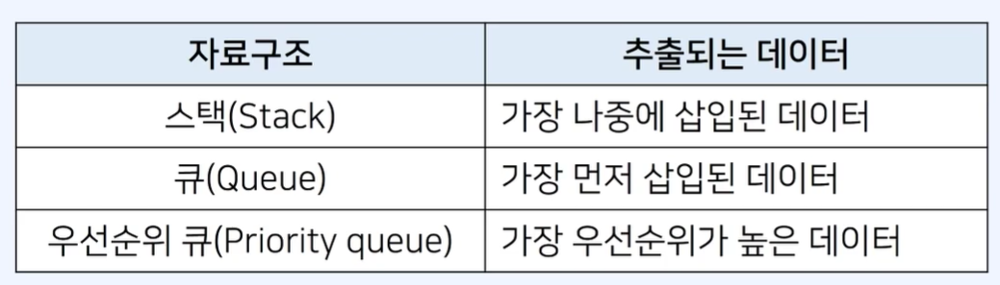
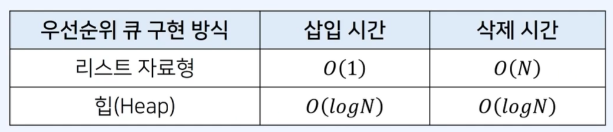
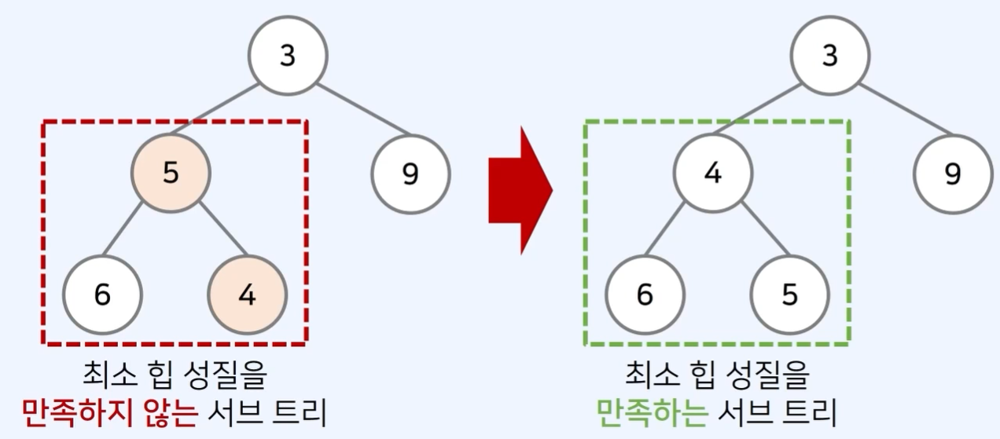

# 트리 

- 트리는 가계도와 같이 계층적인 구조를 표현할 때 사용할 수 있는 자료구조이다.
- 나무 형태를 뒤집은 모양

### 루트 노드(root node): 부모가 없는 최상위 노드
### 단말 노드(left node): 자식이 없는 노드

- **트리(Tree)**: 에서는 부모와 자식 관계가 성립한다. 
- **형제관계**: 17을 값으로 가지는 노드와 48을 가지는 노드 사이의 관계
- **깊이(depth)**: 루트 노드에서의 길이(length)
  - 여기서 길이(length)란, 출발 노드에서 목적지 노드까지 거쳐야 하는 간선의 수를 의미
  - 트리의 높이는 루트 노드에서 가장 깊은 노드의 길이를 의미
  

## 이진 트리(Binary Tree)

- 이진 트리는 최대 2개의 자식을 가질 수 있는 트리를 말한다. 

# 우선순위 큐(Priority Queue)

- 우선순위 큐는 우선순위에 따라서 데이터를 추출하는 자료구조
- 컴퓨터 운영체제, 온라인 게임 매칭 등에서 활용
- 우선순위 큐는 일반적으로 힙(Heap)을 이용하여 구현한다. 

## 우선순위 큐 구현 방식

- 데이터의 개수가 N개일 때, 구현 방식에 따른 시간 복잡도는 다음과 같다.

- 일반적인 형태의 큐는 선형적인 구조를 가진다. 
- 반면에 **우선순위 큐**는 **이진트리 구조**를 사용하는 것이 일반적이다.

## 포화 이진 트리(Full Binary Tree)

- 리프 노드를 제외한 모든 노드가 두 자식을 가지고 있는 트리

## 완전 이진 트리(Complete Binary Tree)

- 완전 이진 트리는 모든 노드가 왼쪽부터 차근차근 채워진 트리이다. 

## 높이 균형 트리(Height Balenced Tree)

- 왼쪽 자식 트리와 오른쪽 자식 트리의 높이가 1이상 차이 나지 않는 트리이다. 

# 힙(Heap)

- 힙(Heap)은 원소들 중에서 최댓값 혹은 최솟값을 빠르게 찾아내는 자료구조이다. 
- 최대 힙(max heap): 값이 큰 원소부터 추출한다. 
- 최소 힙(min heap): 값이 작은 원소부터 추출한다. 
- 힙은 원소의 삽입과 삭제를 위해 O(logN)의 수행 시간을 요구한다. 
- 단순한 N개의 데이터를 힙에 넣었다가 꺼내는 작업은 정렬과 동일하다. 
- 이 경우 시간 복잡도는 O(logN)이다. 

## 최대 힙(Max heap)

- 부모 노드가 자식보다 값이 큰 완전 이진트리
- 최대 힙의 루트 노드는 전체 트리에서 가장 큰 값을 가진다는 특징 존재. 

## 힙의 특징

- 힙은 완전 이진 트리 자료구조를 따른다.
- 힙에서는 우선순위가 높은 노드가 루트에 위치한다. 
1. **최대 힙(max heap)**
- 부모 노드의 키 값이 자식 노드의 키 값보다 항상 크다
- 루트 노드가 가장 작으며, 값이 작은 데이터가 우선 순위를 가진다. 
2. **최소 힙(min heap)**
- 부모 노드의 키 값이 자식 노드의 키 값보다 항상 작다.
- 루트 노드가 가장 작으며, 값이 작은 데이터가 우선순위를 가진다. 

## 최소 힙 구성 함수: Heapify

- (상향식) 부모로 거슬러 올라가며, 부모보다 자신이 더 작은 경우 위치를 교체
- 

## 힙에 새로운 원소가 삽입될 때
- (상향식) 부모로 거슬러 올라가며, 부모보다 자신이 더 작은 경우 위치를 교체한다. 
- 새로운 원소가 삽입되었을 때 O(logN)의 시간 복잡도로 힙 성질을 유지하도록 할 수 있다. 

## 힙에 새로운 원소가 삭제될 때 
- 원소가 제거되었을 때 O(logN)의 시간 복잡도로 힙 성질을 유지하도록 할 수 있다. 
- 원소를 제거할 때는 가장 마지막 노드가 루트 노드의 위치에 오도록 한다. 
